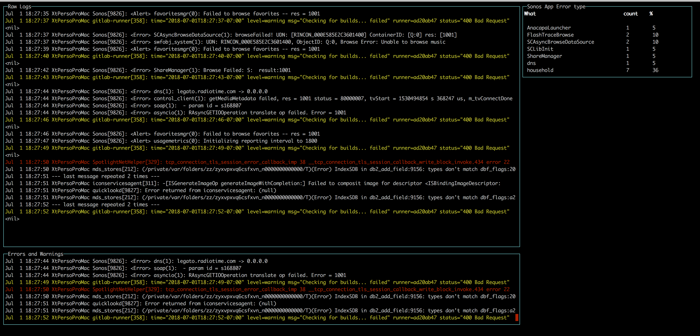
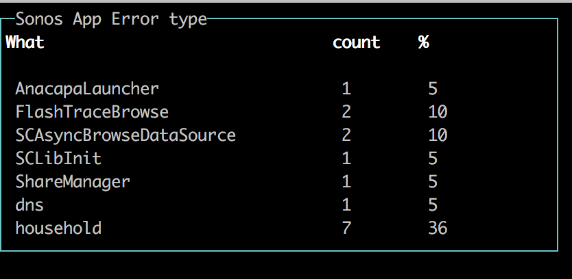

# tailchart

A smarter way to follow files and logs.



## Install

`npm install -g tailchart`

## Usage

`tailchart` 
 
Make the assumption that you have a `config.json` file in the current directory.

You can specific the path of the configuration file by using the 
`tailchart --config mypath/conf.json` 

Once running, press "r" to reset the value in the different widgets.

## Configuration

At this point in time, tailchart require a configuration file to starts.
 
When running, tailchart display info of the full surface of the terminal window.
You position and size the different widgets by using a grid system.

Below is an example of a valid configuration (comments are automatically stripped out):
```json
{
  // Required, only one value for now
  "version": "1.0",

  // Required. Path to the fail we will tail
  "source": "/var/log/system.log",

  // Required. Must be an array of objects
  "widgets": [
    // Raw Log Widget
    // Display all log lines
    {
      "type": "raw",      // required
      "name": "Raw Logs", // Required, must unique accross all widgets
      "col": 0,     // required, integer
      "colspan": 1, // required, integer
      "row": 0,     // required, integer
      "rowspan": 1, // required, integer
      
      "prefixTrimIndex": 0, // optional, integer. Remove the N first character of the line
      "highlights": {
        "lines": [ // optional, array. Each line match will be printed in the specified color
          {
            "color": "red",   // required, string
            "match": "error" // required, string that compile to a valid regular expression
          }
        ]        
      }
    },
    
    // Filter Log Widget
    // Display only the log lines that match a regular expression. 
    // + all functionnality of raw
    {
      "type": "filter",   // required
      "name": "Raw Logs", // Required, must unique accross all widgets
      "col": 0,     // required, integer
      "colspan": 1, // required, integer
      "row": 0,     // required, integer
      "rowspan": 1, // required, integer
      
      // Specific options
      "match": "error|warning", // required, string compiling to regular expression. Define what is capture by widget
      
      // Options inherited from RawLog
      "prefixTrimIndex": 0, // optional, integer. Remove the N first character of the line
      "highlights": {
        "lines": [ // optional, array. Each line match will be printed in the specified color
          {
            "color": "red",   // required, string
            "match": "error"  // required, string that compile to a valid regular expression
          }
        ]        
      }
    },

    // Split Counter Widget
    {
      "type": "splitCounter",         // required 
      "name": "Sonos App Error type", // Required, must unique accross all widgets
      "col": 3,     // required, integer
      "colspan": 1, // required, integer
      "row": 0,     // required, integer
      "rowspan": 1, // required, integer
      
      // Specific options
      "match": "<Error> ([a-z]+)" // require, string compiling to regular expression.
                                  // must have 1 capturing group
    }
  ]
}

```

## Widgets

### RawLog
Display all the logs line.
Optionally:
- trim the N first character of the line (perfect to remove useless prefix)
- display in a specific color lines matching a regular expression

```json
{
  "type": "raw", // required
  "name": "Raw Logs", // Required, must unique accross all widgets
  "col": 0, // required, integer
  "colspan": 3, // required, integer
  "row": 0, // required, integer
  "rowspan": 3, // required, integer
  "prefixTrimIndex": 0, // optional, integer. Remove the N first character of the line
  "highlights": {
    // optional, objecct
    "lines": [
      {
        "color": "red",
        "match": "error"
      },
      {
        "color": "yellow",
        "match": "warning"
      }
    ]
  }
}
```


### FilterLog
Same functionality as RawLog with the twist that it display only the lines that are matching a regular expression.

```json
{
  "type": "filter",
  "name": "Errors and Warnings",
  "col": 0, // required, integer
  "colspan": 3, // required, integer
  "row": 3, // required, integer
  "rowspan": 1, // required, integer

  "match": "error|warning",

  "prefixTrimIndex": 0, // optional, integer. Remove the N first character of the line
  "highlights": {
    // optional, objecct
    "lines": [
      {
        "color": "red",
        "match": "error"
      },
      {
        "color": "yellow",
        "match": "warning"
      }
    ]
  }
}
```


### Counter
Count how many times something happen, and its frequency compare to other match.
Perfect to visualize the distribution of error, type of queries, status code, etc


```json
{
      "type": "counter",
      "name": "Sonos App Error type",
      "match": "<Error> ([a-z]+)",
      "col": 3,
      "colspan": 1,
      "row": 0,
      "rowspan": 2
    }
```


## Dreamlist

- [ ] Read from stdin to allow piping
- [ ] Zero config start
- [ ] In program UI to add/modify/remove widgets
- [ ] Config import (like blue print in Factorio)
- [ ] Save / Load config
- [ ] Replay logs